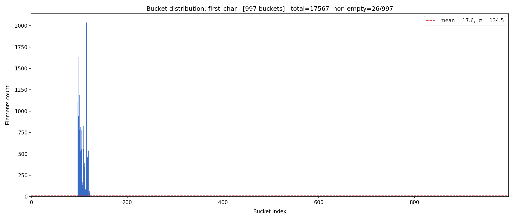
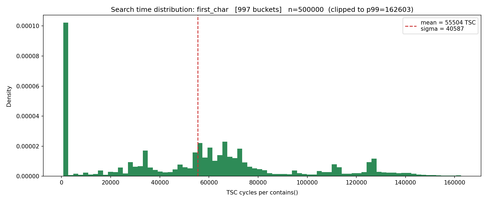
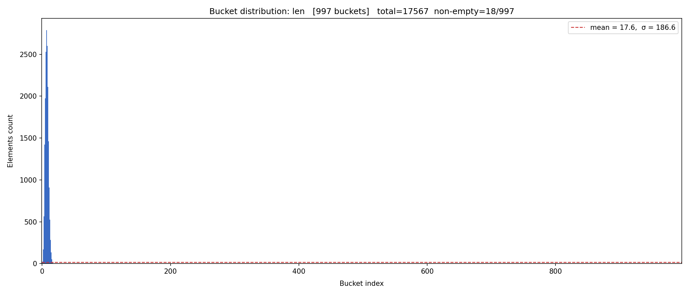
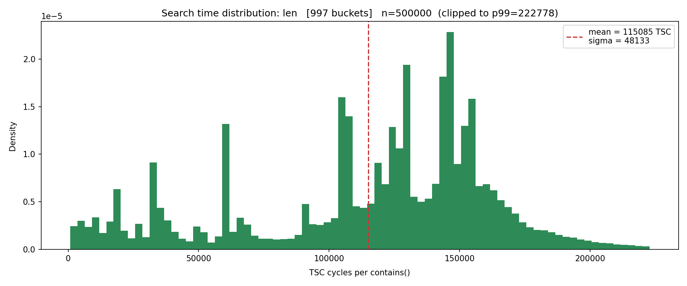
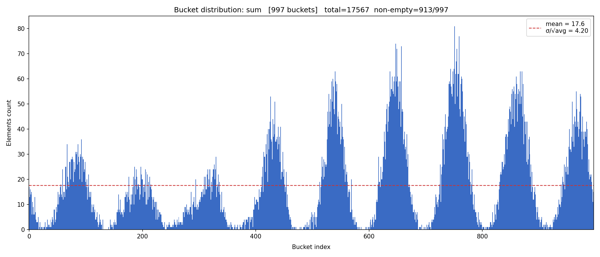
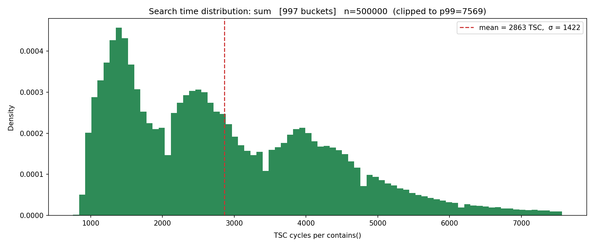
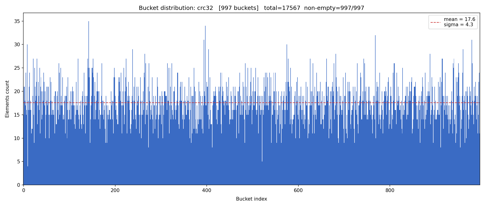
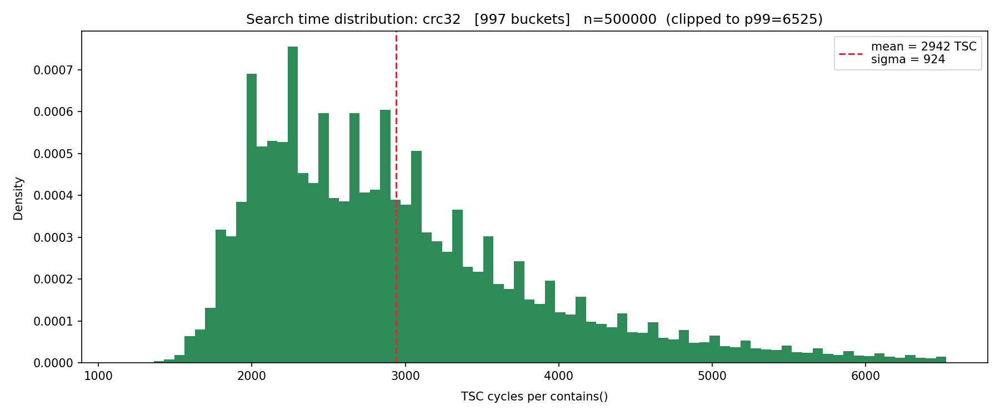

# x_hashset

Моя учебная реализация хеш-сета в рамках курса Ильи Дединского.

## Данные для бенчмарка

### Обучающий набор (`texts/words.txt`)

Уникальные слова из романа "Война и мир" Толстого (английский перевод, Project Gutenberg).
Загрузка исходного текста:
```
wget https://www.gutenberg.org/files/2600/2600-0.txt -O texts/war_and_peace.txt
```
Из текста удалены служебные части и дублирующиеся слова. Итого ~17 500 уникальных слов.
Этот набор загружается в хеш-сет перед каждым тестом.

### Тестовый набор (`texts/test_words.txt`)

Системный словарь английского языка `/usr/share/dict/words` (~104 000 слов).
Используется исключительно для вызовов `contains` - в хеш-сет не загружается.
Намеренно выбран отличным от обучающего набора, чтобы часть запросов давала промах (`false`).

Для воспроизведения:
```
cp /usr/share/dict/words texts/test_words.txt
```

## Сравнение хеш-функций

Для каждой функции: гистограмма заселённости бакетов (сколько элементов попало в каждый бакет) и гистограмма времени поиска `contains` в тактах процессора (TSC).

---

### `why_not` - константа 1

Все элементы в одном бакете. Поиск - линейный обход.


---

### `first_char` - ASCII первого символа

Не более 26 занятых бакетов (по числу букв алфавита). Все остальные пусты.




---

### `len` - длина слова

Большинство английских слов укладывается в диапазон длин 3-10, бакеты за его пределами пусты.




---

### `sum` - сумма ASCII-кодов символов

При 997 бакетах распределение выглядит неплохо, но сумма кодов лингвистически ограничена сверху - при увеличении таблицы большинство бакетов остаётся пустыми.




#### `sum` при 5003 бакетах


---

### `rol` - rotate-left XOR


---

### `ror` - rotate-right (TODO: сейчас просто XOR)

Реализация не завершена - совпадает с `xor`, отсюда плохое распределение.


---

### `crc32`

Равномерное распределение, все бакеты заняты. Лучший результат среди протестированных функций.




#### `crc32` при 5003 бакетах

В отличие от `sum`, равномерность сохраняется.


**В дальнейших тестах я буду использовать crc32.**

---

## Профилирование (`perf record -g`, crc32, 997 бакетов)

Один прогон: 17 567 слов загружено, 100 * 104 334 вызовов `contains`.

### До оптимизации (верификатор включён)

~13.2B тактов суммарно.

| Функция | % времени |
|---------|----------:|
| `x_list::verifier` | **52.84%** |
| `hash::crc32` | 20.31% |
| `x_list::slow::search` (без верификатора) | ~13% |
| прочее (`contains`, overhead) | ~14% |

Более половины времени - отладочная проверка структуры списка на каждый вызов `contains`.

### После: `-DX_LIST_NO_VERIFY`

~6.8B тактов суммарно - **в 2 раза быстрее**.

| Функция | % времени (self) |
|---------|----------------:|
| `x_list::slow::search` | **48.63%** |
| `hash::crc32` | 39.49% |
| `x_hashset::contains` | 6.91% |

### Сравнение

| | С верификатором | Без верификатора |
|-|----------------:|-----------------:|
| Суммарно тактов | ~13.2B | ~6.8B |
| Коэффициент ускорения | 1x | **1.94x** |

### Следующие цели

| Приоритет | Функция | Идея |
|-----------|---------|------|
| 1 | `x_list::slow::search` | Заменить связный список на массив (меньше pointer chasing) |
| 2 | `hash::crc32` | Аппаратная инструкция (`_mm_crc32_u32` / `__builtin_ia32_crc32si`) |

