# x_hashset

Моя учебная реализация хеш-сета в рамках курса Ильи Дединского.

Данный readme не является полноценным отчетом о проделанной работе, а является планом для меня на сдаче работы. Полноценный отчет будет написан позже.

Кратко о чем работа:

Цель работы:
1) написать хеш-таблицу (в моем случае set) и проанализировать разные хеш функции на "заселенность".
2) провести бенчмарки, выявить самые нагруженные места и соптимизировать.

В ходе данной работы была написана последняя базовая структура данных, проведено сравнение разных хеш функций и оптимизаций.

## Данные для бенчмарка

### Обучающий набор (`texts/words.txt`)

Уникальные слова из романа "Война и мир" Толстого (английский перевод, Project Gutenberg).
Загрузка исходного текста:
```
wget https://www.gutenberg.org/files/2600/2600-0.txt -O texts/war_and_peace.txt
```
Из текста удалены служебные части и дублирующиеся слова. Итого ~17 500 уникальных слов.
Этот набор загружается в хеш-сет перед каждым тестом.

### Тестовый набор (`texts/test_words.txt`)

Системный словарь английского языка `/usr/share/dict/words` (~104 000 слов).
Используется исключительно для вызовов `contains` - в хеш-сет не загружается.
Намеренно выбран отличным от обучающего набора, чтобы часть запросов давала промах (`false`).

Для воспроизведения:
```
cp /usr/share/dict/words texts/test_words.txt
```

# Часть 1: Сравнение хеш-функций

Для каждой функции: гистограмма заселённости бакетов (сколько элементов попало в каждый бакет) и гистограмма времени поиска `contains` в тактах процессора (TSC).

Большинство измерений проводилось на размере 501 (why_not измерено на 997, но для нее размер таблицы вообще не влияет), там где использовался другой размер это явно указано.

---

### `why_not` - константа 1

Все элементы в одном бакете. Поиск - линейный обход.
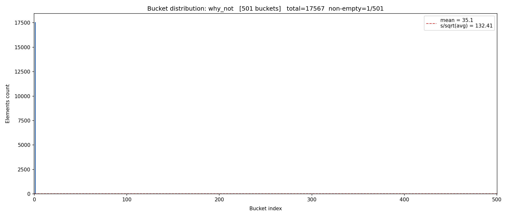

---

### `first_char` - ASCII первого символа

Не более 26 занятых бакетов (по числу букв алфавита). Все остальные пусты.


#### 197 бакетов

Распределение не меняется, но за счет большего масштаба лучше видно детали

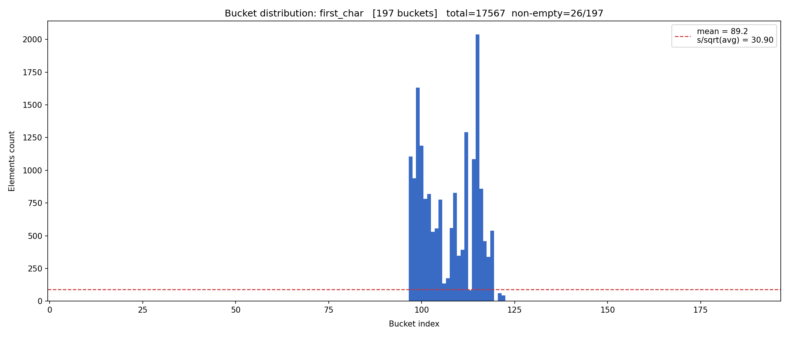

---

### `len` - длина слова

Большинство английских слов укладывается в диапазон длин 3-10, бакеты за его пределами пусты.

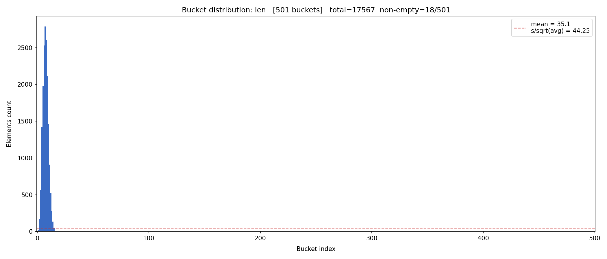

#### 97 бакетов

Распределение не меняется, но за счет большего масштаба лучше видно детали
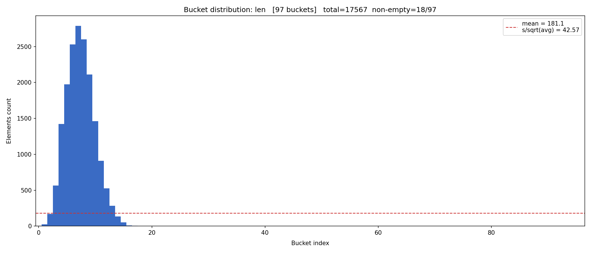

---

### `sum` - сумма ASCII-кодов символов

При 501 бакетах распределение выглядит неплохо, но сумма кодов лингвистически ограничена сверху - при увеличении таблицы большинство бакетов остаётся пустыми.


#### `sum` при 5003 бакетах

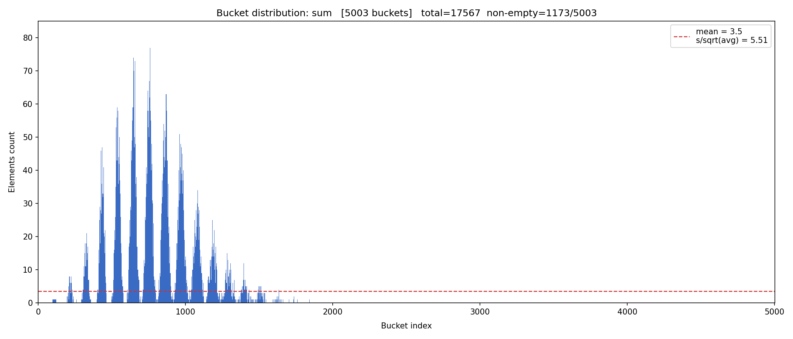

---

### `rol` - rotate-left XOR

Показывает результат близкий к crc32.

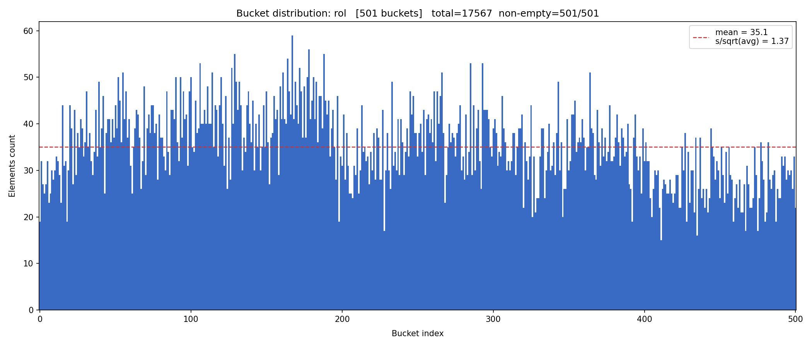

#### `rol` при 5003 бакетах

Распределение остается хорошим при увеличении размера хеш таблицы и занимает весь диапазон в отличии от `sum`.

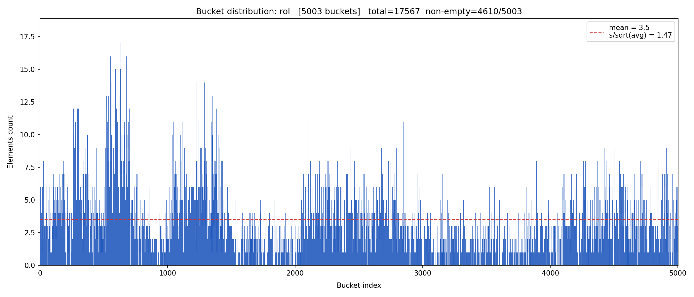

---

### `ror` - rotate-right XOR

Распределение заметно хуже, чем у `rol`: видны колебания, похожие на `sum`, но по всему диапазону значений.

Причина  -  асимметрия направления ротации и места подмешивания символа. ASCII-символы  -  7-битные значения; XOR вписывает каждый новый символ в младшие биты хеша. `rol` сдвигает накопленное влево, освобождая низкие биты для следующего символа  -  вклады разных символов расходятся по разным позициям. `ror` сдвигает накопленное вправо, прямо в ту же зону, куда придёт следующий символ  -  все вклады суммируются в одних и тех же низких битах, как в `sum`. Высокие биты всё же задействованы (бит 0 при правой ротации уходит в бит 63), поэтому хеш охватывает весь диапазон  -  в отличие от `sum`  -  но регулярность в низких битах сохраняется.

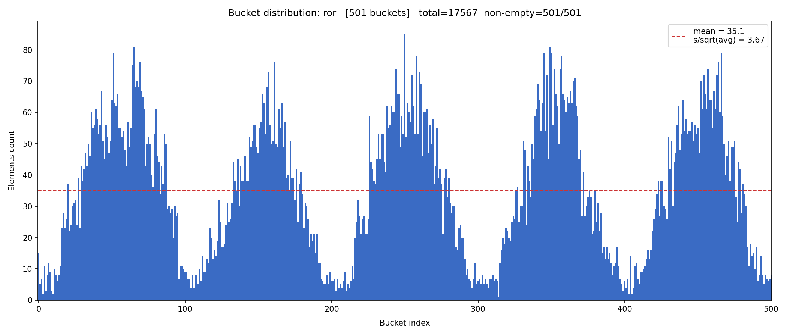

#### `rol` при 5003 бакетах

Распределение остается не очень хорошим при увеличении размера хеш таблицы, но занимает весь диапазон в отличии от `sum`.

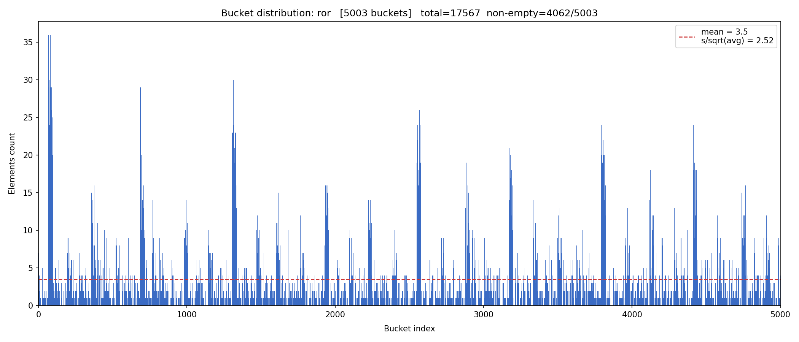

---

### `crc32`

Равномерное распределение, все бакеты заняты. Лучший результат среди протестированных функций.


#### `crc32` при 5003 бакетах

В отличие от `sum`, равномерность сохраняется.

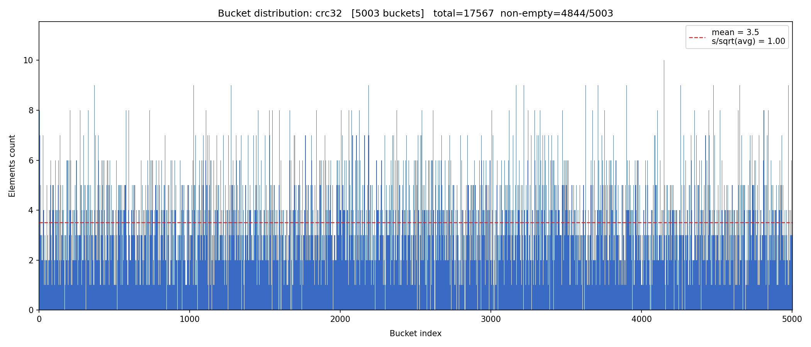

## Итоговое сравнение хеш-функций

17 567 слов.\
$\sigma/\sqrt{\text{avg}}$  -  нормированное отклонение заселённости. Для идеального случайного хеша $\approx 1.0$; чем больше  -  тем хуже.

(для построения таблицы использовались данные из предыдущих тестов)

| Функция | Занятых / всего | $\sigma/\sqrt{\text{avg}}$ | Масштабируемость |
|---------|----------------|------------------:|-----------------|
| `why_not` | 1/997 | 132 |  -  |
| `first_char` | 26/197, 26/501, 26/997 | 30.9, 31.8, 32.0 |  -  |
| `len` | 18/97, 18/501, 18/997 | 42.6, 44.2, 44.4 |  -  |
| `sum` | 501/501, 913/997, 1173/5003 | 2.83, 4.20, 5.51 | нет  -  при росте таблицы деградирует |
| `ror` | 501/501, 997/997 | 3.67, 3.25 | да, но `rol` отличается 1 инструкцией и даёт результат в 2x лучше |
| `rol` | 501/501, 997/997 | 1.37, 1.42 | да |
| `crc32` | 501/501, 997/997, 4844/5003 | **1.00, 1.01, 1.00** | да  -  идеал на всех размерах |

**В дальнейших тестах я буду использовать crc32.**

---

# Часть 2: Оптимизации

Железо: AMD EPYC 7542, ОС: Ubuntu 22.04.5, kernal: 5.15.0-176, компилятор gcc, версии 11.4.0.

Замер через `perf record -F 999`. Базовый оптимизатор: `-Ofast`.

## Профилирование (`perf record -g`, crc32, 997 бакетов)

Один прогон: 17 567 слов загружено, 100 * 104 334 вызовов `contains`.

### До оптимизации (верификатор включён)

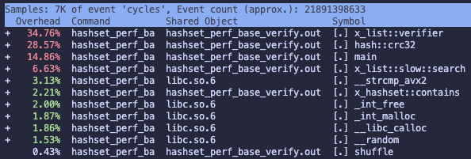
19_403_679_480 тактов

Более половины времени - отладочная проверка структуры списка на каждый вызов `contains`.

## Оптимизация 0: отключаем дебаг:

### После: `-DX_LIST_NO_VERIFY` и `-DNDEBUG`

#### Оптимизатор `-O0`
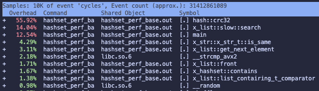
31_412_861_089 такта

#### Оптимизатор `-O1`
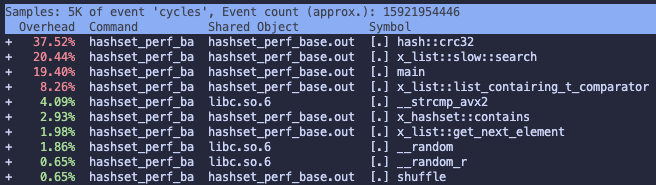
12_966_737_657 такта

#### Оптимизатор `-O2`
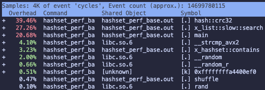\
10_632_040_282 такта

#### Оптимизатор `-O3`
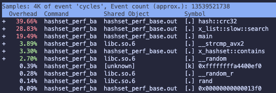\
13_539_521_738

#### Оптимизатор `-Ofast`
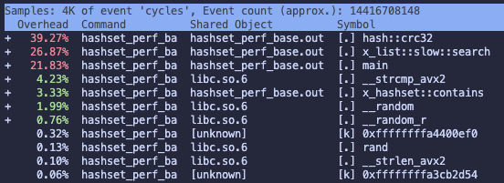\
14_416_708_148

### Сравнение

| Оптимизатор | Такты | Относительно `-O2` |
|---|---:|---:|
| `-O0` | 31.41B | 2.96x медленнее |
| `-O1` | 12.97B | 1.22x медленнее |
| **`-O2`** | **10.63B** | **1.0x (база)** |
| `-O3` | 13.54B | 1.27x медленнее |
| `-Ofast` | 14.42B | 1.36x медленнее |

Дальше буду использовать `-O2`.

## Оптимизация 1: SoA-бакеты + AVX2

Изменим архитектуру отказавшись от связных списков (моя хеш таблица гарантирует только добавление и поиск за O(k) (k - средний размер бакета), а удаление будет за O(N) и в моем понимании это не большая проблема)

### Идея

Связный список в каждом бакете заменён на **Structure of Arrays**:

```
bucket_t {
    uint64_t *hashes;   // все хеши подряд - SIMD-сканирование
    size_t   *lens;
    char    **strs;
    size_t    size, capacity;
}
```

Хеши хранятся в отдельном плоском массиве. Это даёт два выигрыша:

1. **Cache locality** - не прыгаем через `next`-указатели списка; 17 хешей бакета лежат в одной строке кэша (17 * 8 = 136 байт примерно 3 cache line против AoS где каждый `list_element_t` = 48 байт с рассыпанными полями).
2. **SIMD** - AVX2 загружает 4 хеша за одну инструкцию `_mm256_loadu_si256` и сравнивает их все с `_mm256_cmpeq_epi64`. Промах по всем четырём - `movemask == 0`, без условных переходов.


### Результаты

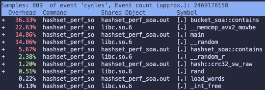\
2_469_178_158 такта

## Оптимизация 2: заменим хеш на аппаратный

### После: `crc32_hw` (аппаратный интринсик)


Программный `crc32` заменён на `_mm_crc32_u32` / `_mm_crc32_u8` (SSE4.2).
Обрабатывает 4 байта за такт вместо побитового вычисления.

### Результаты

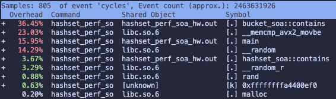\
2_463_631_926 такта

---

## Оптимизация 3: Заменить strcmp и strlen на аппаратные интринсики.

Идея: выравниваем все строки по 32, чтобы можно было их быстро загружать в ymm регистры.
Заменяем strcmp на реализацию с использованием ymm регистров.
И strcmp и crc32 не рассматривают крайние случаи когда данные невыровнены, поскольку мы выравниваем их при загрузке.

### Результаты

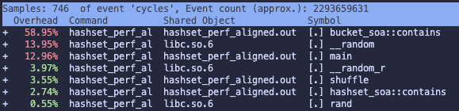\
2_293_659_631 такта

---

## Сводная таблица оптимизаций

Конфигурация: 997 бакетов, 17 567 слов загружено, 100 000 вызовов `contains` за реп, 100 репов, случайный порядок. Медиана по 100 репам.

| Этап | Ключевое изменение | Медиана, мс | Ускорение от базы | Ускорение шага |
|------|--------------------|------------:|------------------:|---------------:|
| Базовая | верификатор + soft crc32 | 68.2 | 1x | - |
| Оптимизация 0 | `-DX_LIST_NO_VERIFY`, `-DNDEBUG` | 44.4 | 1.54x | 1.54x |
| Оптимизация 1 | SoA-бакеты + AVX2 | 6.0 | 11.4x | 7.4x |
| Оптимизация 2 | `crc32_hw` (SSE4.2) | 6.1 | 11.2x | 0.92x |
| Оптимизация 3 | Выровненные строки + SIMD strcmp + unrolled CRC32 | **5.1** | **13.4x** | 1.2x |

### Время одного прогона (мс)

100 прогонов x 100 000 вызовов `contains`, случайный порядок, `clock_gettime(CLOCK_MONOTONIC)`.

<!-- timing-table -->

| variant | reps | median rep ms | sigma ms | min rep ms | max rep ms |
|---|---|---|---|---|---|
| `base_verify` | 100 | 68.2 | 5.5 | 54.7 | 84.0 |
| `base` | 100 | 44.4 | 2.7 | 39.6 | 51.8 |
| `soa` | 100 | 6.0 | 0.9 | 4.7 | 13.1 |
| `soa_hw` | 100 | 6.1 | 0.7 | 5.2 | 8.7 |
| `aligned` | 100 | 5.1 | 1.2 | 4.0 | 9.5 |
