# x_hashset

Моя учебная реализация хеш-сета в рамках курса Ильи Дединского.

Данный readme не является полноценным отчетом о проделанной работе, а является планом для меня на сдаче работы. Полноценный отчет будет написан позже.

Кратко о чем работа:

Цель работы:
1) написать хеш-таблицу (в моем случае set) и проанализировать разные хеш функции на "заселенность".
2) провести бенчмарки, выявить самые нагруженные места и соптимизировать.

В ходе данной работы была написана последняя базовая структура данных, проведено сравнение разных хеш функций и оптимизаций.

## Данные для бенчмарка

### Обучающий набор (`texts/words.txt`)

Уникальные слова из романа "Война и мир" Толстого (английский перевод, Project Gutenberg).
Загрузка исходного текста:
```
wget https://www.gutenberg.org/files/2600/2600-0.txt -O texts/war_and_peace.txt
```
Из текста удалены служебные части и дублирующиеся слова. Итого ~17 500 уникальных слов.
Этот набор загружается в хеш-сет перед каждым тестом.

### Тестовый набор (`texts/test_words.txt`)

Системный словарь английского языка `/usr/share/dict/words` (~104 000 слов).
Используется исключительно для вызовов `contains` - в хеш-сет не загружается.
Намеренно выбран отличным от обучающего набора, чтобы часть запросов давала промах (`false`).

Для воспроизведения:
```
cp /usr/share/dict/words texts/test_words.txt
```

# Часть 1: Сравнение хеш-функций

Для каждой функции: гистограмма заселённости бакетов (сколько элементов попало в каждый бакет) и гистограмма времени поиска `contains` в тактах процессора (TSC).

Большинство измерений проводилось на размере 501 (why_not измерено на 997, но для нее размер таблицы вообще не влияет), там где использовался другой размер это явно указано.

---

### `why_not` - константа 1

Все элементы в одном бакете. Поиск - линейный обход.

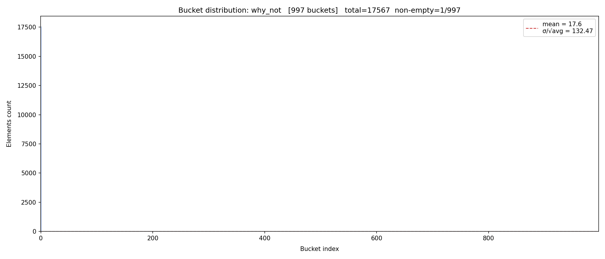
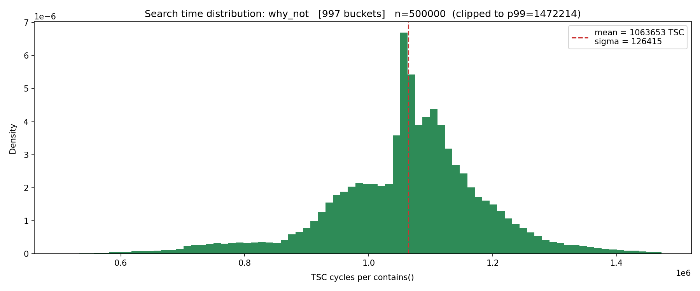

---

### `first_char` - ASCII первого символа

Не более 26 занятых бакетов (по числу букв алфавита). Все остальные пусты.

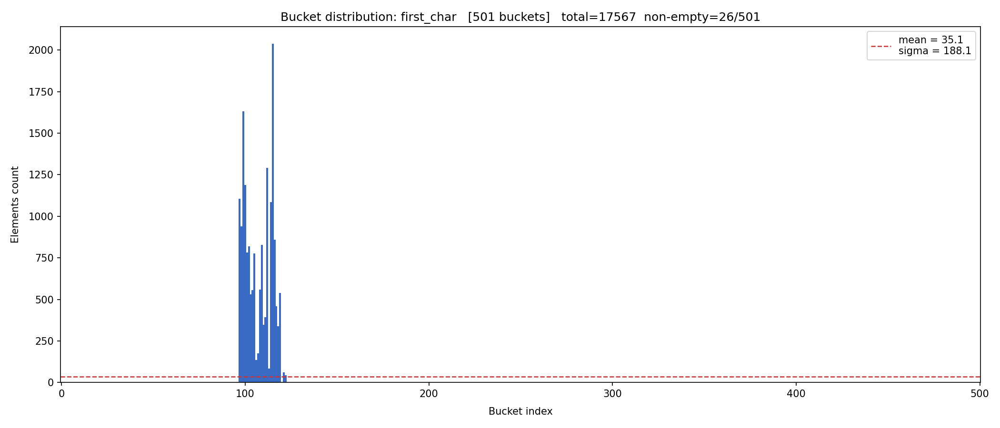
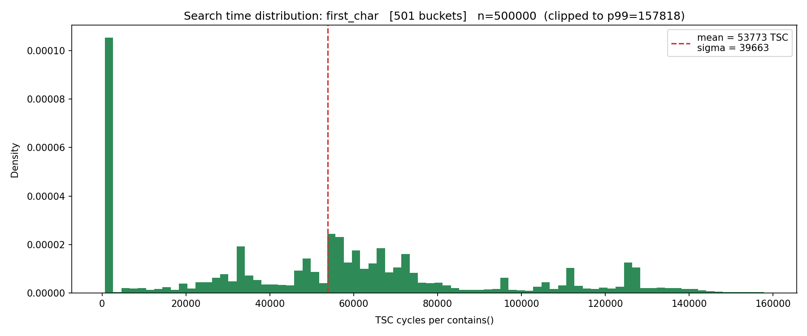

---

### `len` - длина слова

Большинство английских слов укладывается в диапазон длин 3-10, бакеты за его пределами пусты.

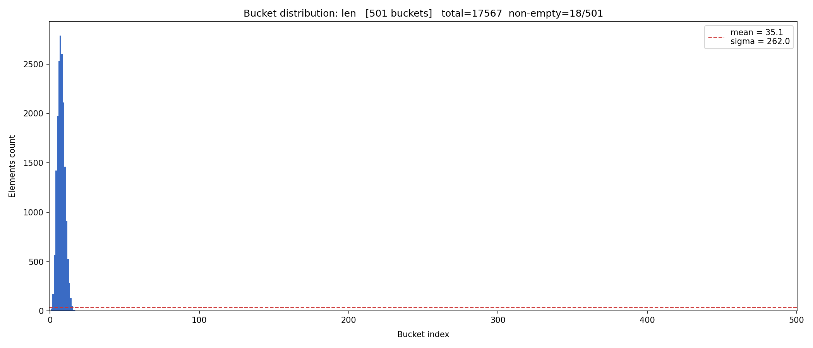
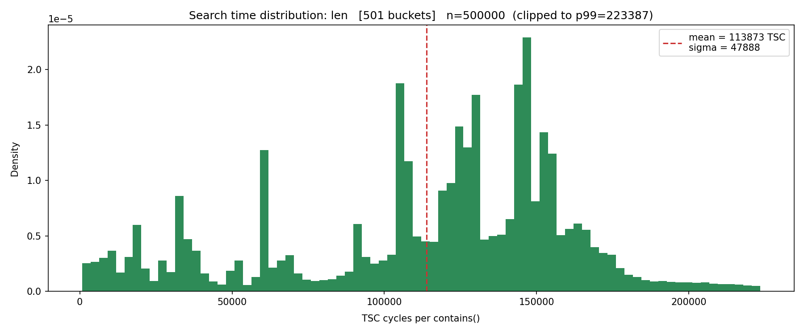

---

### `sum` - сумма ASCII-кодов символов

При 501 бакетах распределение выглядит неплохо, но сумма кодов лингвистически ограничена сверху - при увеличении таблицы большинство бакетов остаётся пустыми.

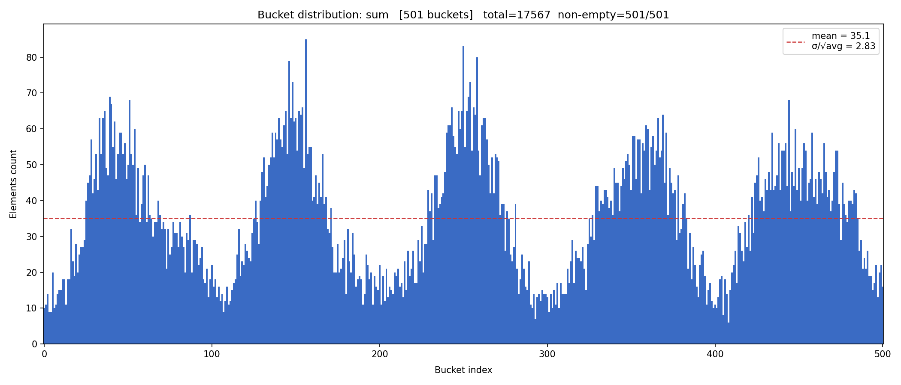
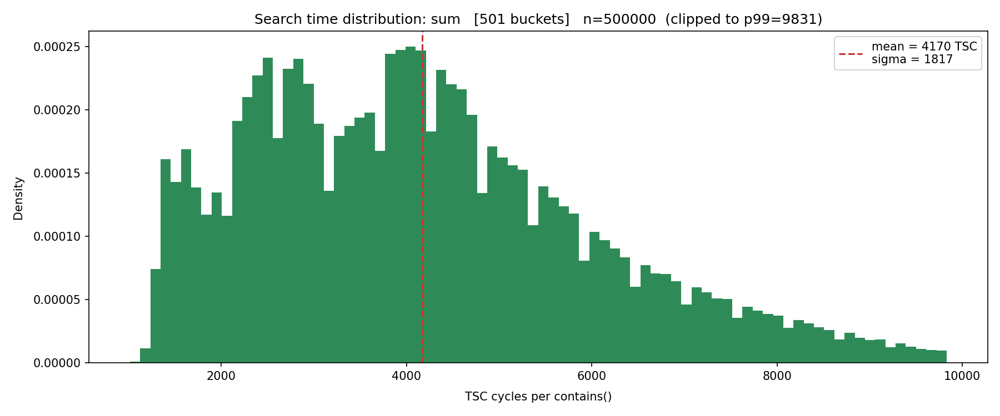

#### `sum` при 5003 бакетах


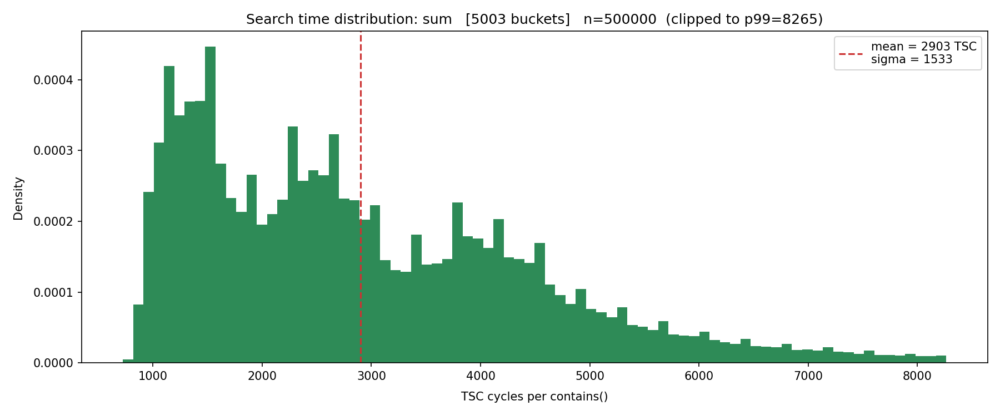

---

### `rol` - rotate-left XOR

Показывает результат близкий к crc32.

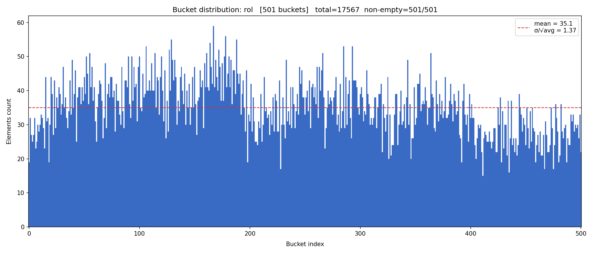
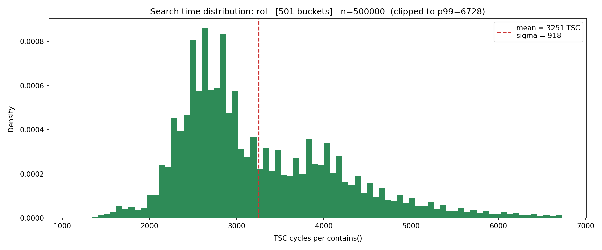

#### при 997 бакетах

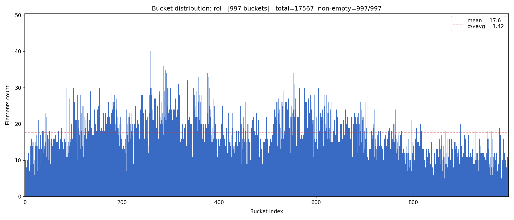
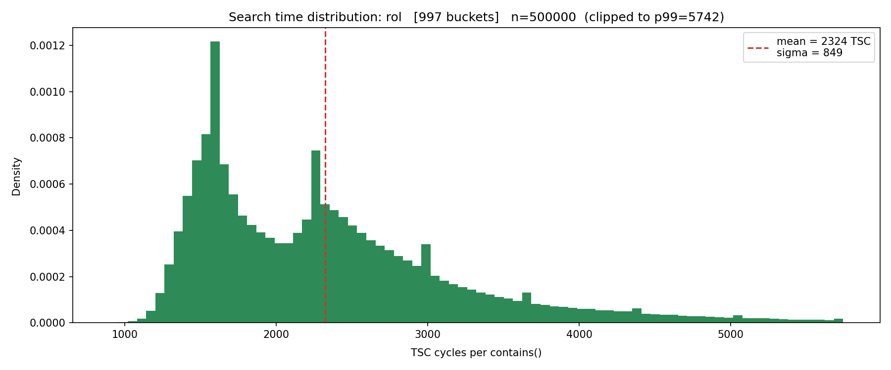

---

### `ror` - rotate-right XOR

Распределение заметно хуже, чем у `rol`: видны колебания, похожие на `sum`, но по всему диапазону значений.

Причина  -  асимметрия направления ротации и места подмешивания символа. ASCII-символы  -  7-битные значения; XOR вписывает каждый новый символ в младшие биты хеша. `rol` сдвигает накопленное влево, освобождая низкие биты для следующего символа  -  вклады разных символов расходятся по разным позициям. `ror` сдвигает накопленное вправо, прямо в ту же зону, куда придёт следующий символ  -  все вклады суммируются в одних и тех же низких битах, как в `sum`. Высокие биты всё же задействованы (бит 0 при правой ротации уходит в бит 63), поэтому хеш охватывает весь диапазон  -  в отличие от `sum`  -  но регулярность в низких битах сохраняется.


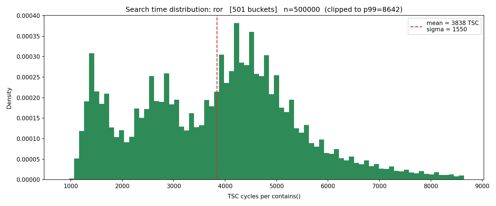

#### при 997 бакетах

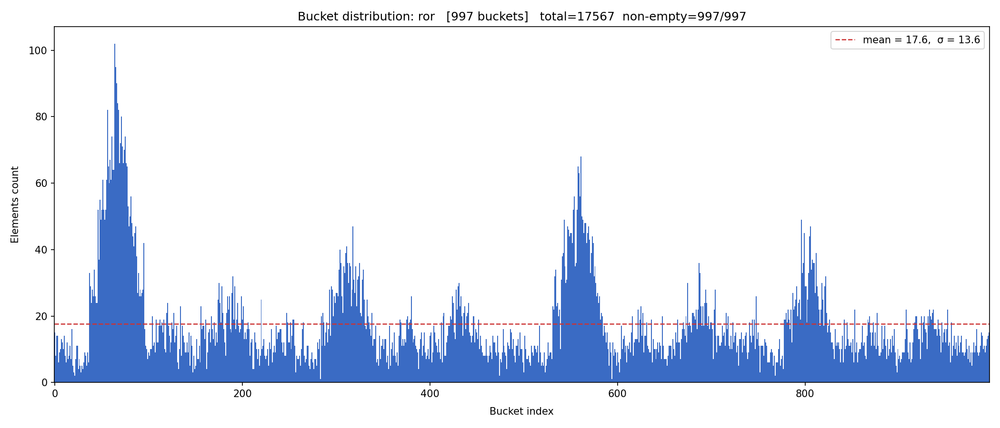
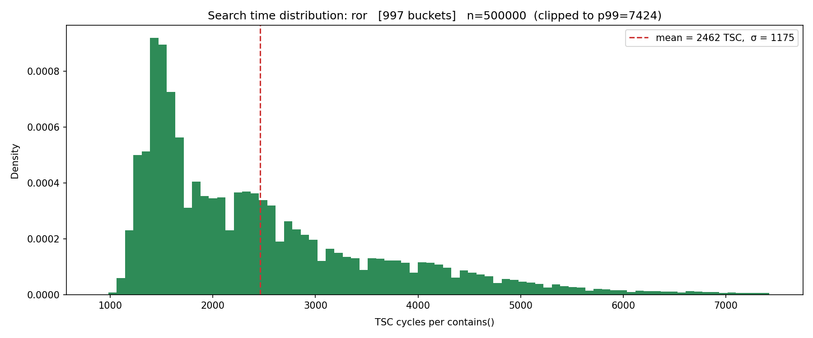

---

### `crc32`

Равномерное распределение, все бакеты заняты. Лучший результат среди протестированных функций.

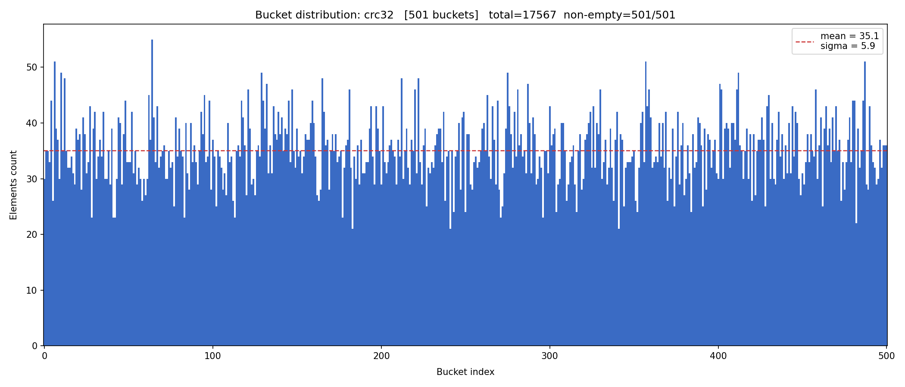
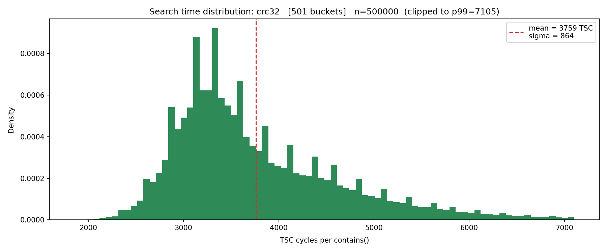

#### `crc32` при 5003 бакетах

В отличие от `sum`, равномерность сохраняется.


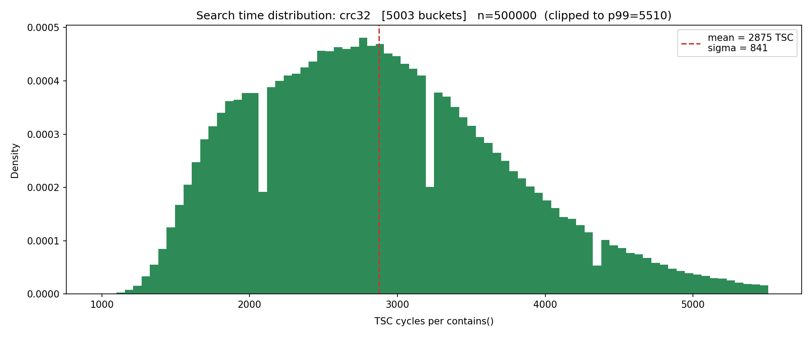

## Итоговое сравнение хеш-функций

17 567 слов.\
$\sigma/\sqrt{\text{avg}}$  -  нормированное отклонение заселённости. Для идеального случайного хеша $\approx 1.0$; чем больше  -  тем хуже.

| Функция | Занятых / всего | $\sigma/\sqrt{\text{avg}}$ | Масштабируемость |
|---------|----------------|------------------:|-----------------|
| `why_not` | 1/997 | 132 |  -  |
| `first_char` | 26/197, 26/501, 26/997 | 30.9, 31.8, 32.0 |  -  |
| `len` | 18/97, 18/501, 18/997 | 42.6, 44.2, 44.4 |  -  |
| `sum` | 501/501, 913/997, 1173/5003 | 2.83, 4.20, 5.51 | нет  -  при росте таблицы деградирует |
| `ror` | 501/501, 997/997 | 3.67, 3.25 | да, но `rol` отличается 1 инструкцией и даёт результат в 2x лучше |
| `rol` | 501/501, 997/997 | 1.37, 1.42 | да |
| `crc32` | 501/501, 997/997, 4844/5003 | **1.00, 1.01, 1.00** | да  -  идеал на всех размерах |

**В дальнейших тестах я буду использовать crc32.**

---

# Часть 2: Оптимизации

Железо: AMD EPYC 7542, ОС: Ubuntu 22.04.5, kernal: 5.15.0-176, компилятор gcc, версии 11.4.0.

Замер через `perf record -F 999`. Базовый оптимизатор: `-Ofast`.

## Профилирование (`perf record -g`, crc32, 997 бакетов)

Один прогон: 17 567 слов загружено, 100 * 104 334 вызовов `contains`.

### До оптимизации (верификатор включён)

#### Сравним разные параметры оптимизатора:

Оптимизатор `-O0`
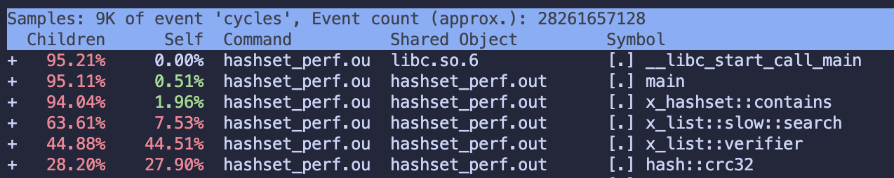
28_261_657_128 тактов

Оптимизатор `-O2`
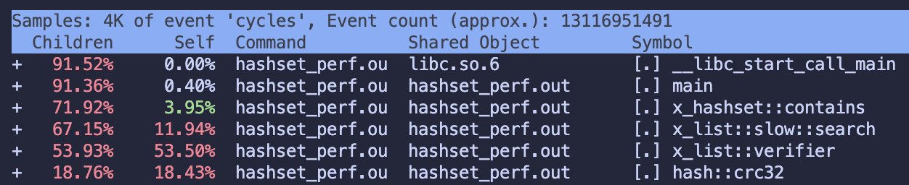
13_116_951_491 тактов

Оптимизатор `-O3`
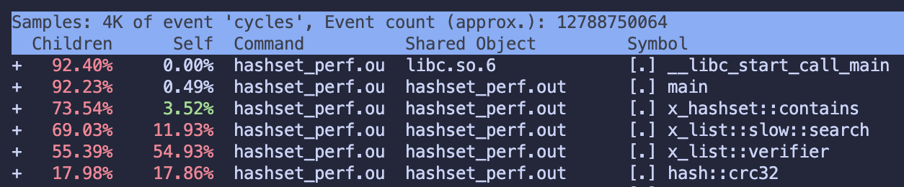
12_788_750_064 тактов

Оптимизатор `-O`
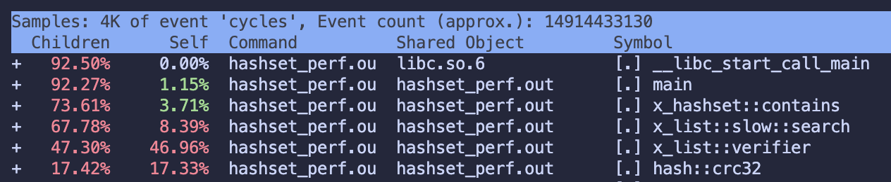
14_914_433_130 тактов

Оптимизатор `-Ofast`
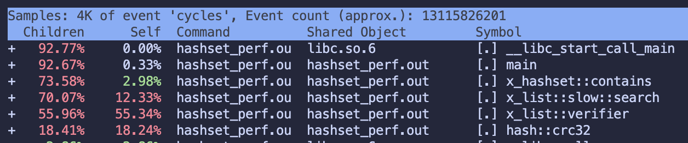
13_115_826_201 тактов

Более половины времени - отладочная проверка структуры списка на каждый вызов `contains`.

## Оптимизация 0: отключаем дебаг:

### После: `-DX_LIST_NO_VERIFY` и `-DNDEBUG`

Оптимизатор `-O0`
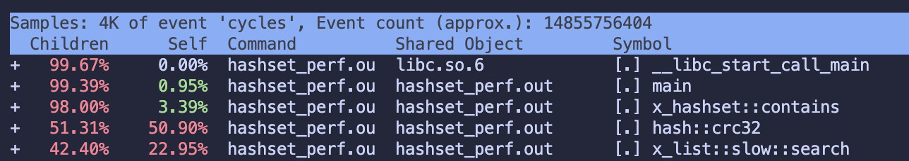
14_855_756_404 тактов

Оптимизатор `-O2`
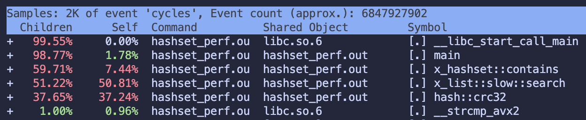
6_847_927_902 тактов

Оптимизатор `-O3`
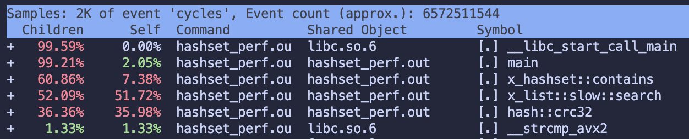
6_572_511_544 тактов

Оптимизатор `-O`
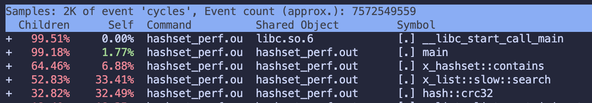
7_572_549_559 тактов

Оптимизатор `-Ofast`
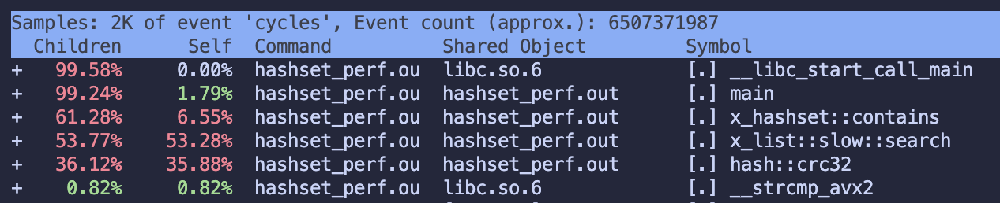
6_507_371_987 тактов

### Сравнение

| Оптимизатор | С верификатором | Без верификатора |
|-|----------------:|-----------------:|
| `-O0` | 28.26B (2.15x)| 14.86B (2.29x)|
| `-O2` | 13.12B (1.0x) | 6.848B (1.05x)|
| `-O3` | **12.79B** (0.98x) | 6.573B (1.01x) |
| `-O`  | 14.91B (1.14x) | 7.573B (1.16x) |
| `-Ofast` | 13.12B (1.0x) | **6.503B** (1.0x) |

Дальше буду использовать `-Ofast`. `-O2`, `-O3` и `-Ofast` равны с точностью до погрешности (отличие +- 2%).

## Оптимизация 1: заменим хеш на аппаратный

Да хеш не самое нагруженное место, но он входит в топ-2 и его замена на интринсик - минимальное влияние на код (использование новой хеш функции). В то время как для ускорения search в связном списке, необходимо изменить архитектуру, что заметно сложнее.

### После: `crc32_hw` (аппаратный интринсик)

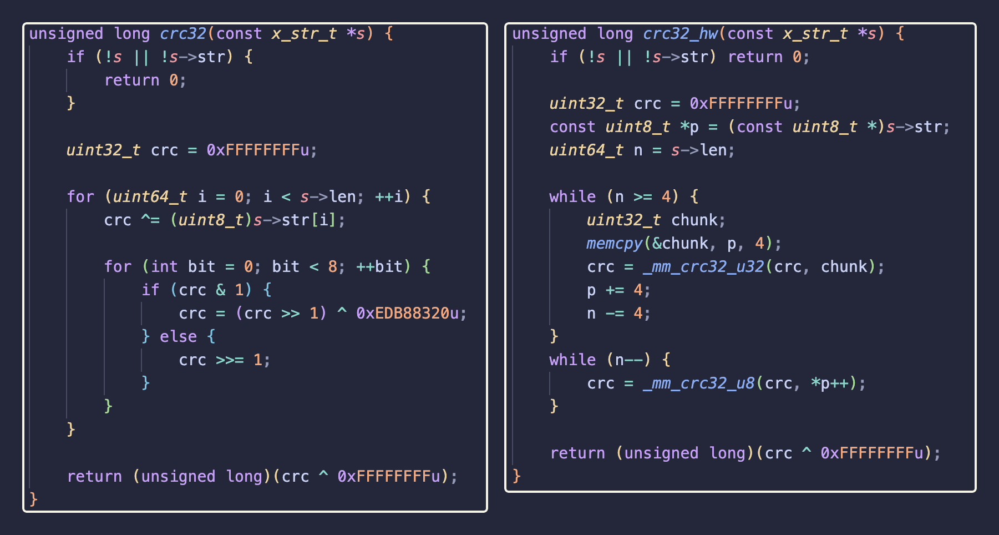

~4.64B тактов суммарно - **в 1.40x быстрее** предыдущего этапа.

Программный `crc32` заменён на `_mm_crc32_u32` / `_mm_crc32_u8` (SSE4.2).
Обрабатывает 4 байта за такт вместо побитового вычисления.

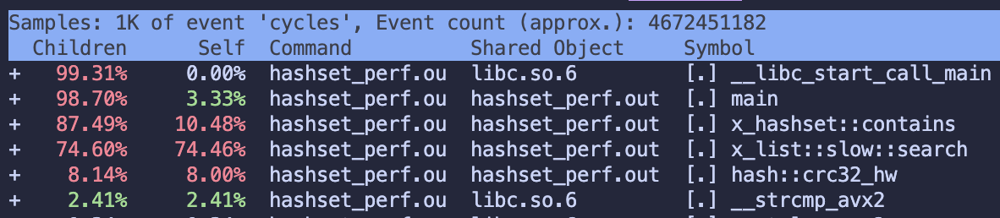

| Функция | % времени (self) |
|---------|----------------:|
| `x_list::slow::search` | **73.74%** |
| `x_hashset::contains` | 11.67% |
| `hash::crc32_hw` | **7.81%** |
| `__strcmp_avx2` | 1.78% |

`crc32` уменьшается с 36% до 7%. Новое узкое место - обход связного списка (75%).

---

## Оптимизация 2: SoA-бакеты + AVX2 (`ветка opt/soa-buckets`)

Теперь уже полноценно изменим архитектуру отказавшись от связных списков (моя хеш таблица гарантирует только добавление и поиск за O(k) (k - средний размер бакета), а удаление будет за O(N) и в моем понимании это не большая проблема)

### Идея

Связный список в каждом бакете заменён на **Structure of Arrays**:

```
bucket_t {
    uint64_t *hashes;   // все хеши подряд - SIMD-сканирование
    size_t   *lens;
    char    **strs;
    size_t    size, capacity;
}
```

Хеши хранятся в отдельном плоском массиве. Это даёт два выигрыша:

1. **Cache locality** - не прыгаем через `next`-указатели списка; 17 хешей бакета лежат в одной строке кэша (17 * 8 = 136 байт примерно 3 cache line против AoS где каждый `list_element_t` = 48 байт с рассыпанными полями).
2. **SIMD** - AVX2 загружает 4 хеша за одну инструкцию `_mm256_loadu_si256` и сравнивает их все с `_mm256_cmpeq_epi64`. Промах по всем четырём - `movemask == 0`, без условных переходов.

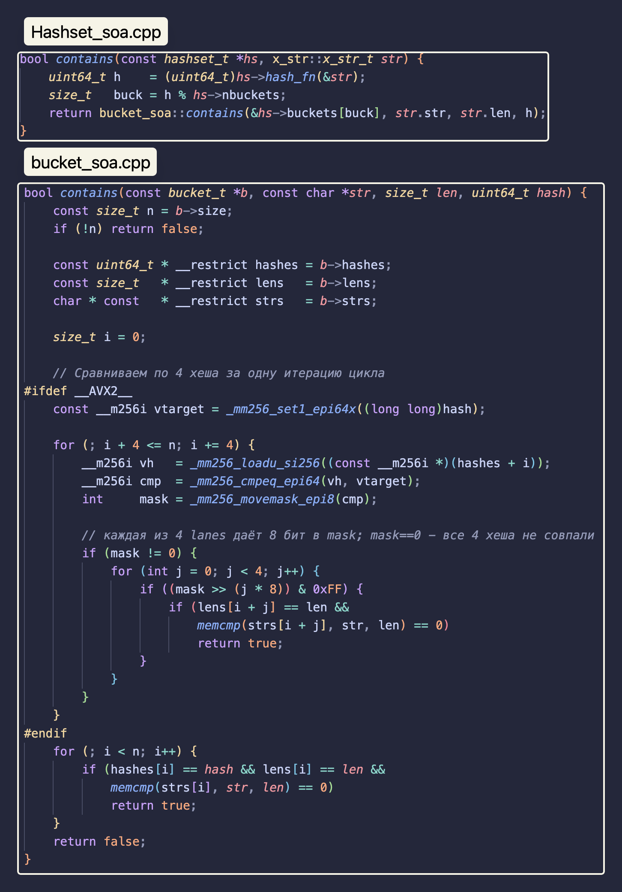

### Результаты

~1.84B тактов - **в 2.47x быстрее** предыдущего этапа.

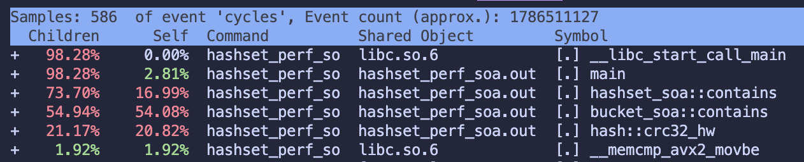

| Функция | % времени (self) |
|---------|----------------:|
| `bucket_soa::contains` | **55.10%** |
| `hash::crc32_hw` | **19.71%** |
| `hashset_soa::contains` (overhead) | 16.71% |
| `__memcmp_avx2_movbe` | 1.52% |

`crc32_hw` снова заметен (20%) - потому что сам поиск ускорился настолько, что хеширование перестало теряться на его фоне.

## Оптимизация 3: Заменить strcmp и strlen на аппаратные интринсики.

### Почему замена `strcmp` на SIMD-интринсик ничего не изменит

Следующий очевидный кандидат на оптимизацию - функция сравнения строк. Но профиль показывает, что `__memcmp_avx2_movbe` занимает **1.52%** суммарного времени. Закон Амдала сразу ограничивает возможный выигрыш:

$
\text{Speedup} \le 1 / (1 - 0.0152) \approx 1.015
$

Меньше 1.5% - в пределах погрешности измерений.

Причина в том, что `contains` фильтрует кандидатов в три этапа:

1. **SIMD-скан хешей** - 4 хеша за инструкцию, без условных переходов
2. **Сравнение длин** - если длины не совпадают, выходим
3. **`strcmp`** - только если хеш И длина совпали

Для crc32 коллизия двух разных слов в одном бакете практически невозможна, поэтому `strcmp` вызывается только при реальном совпадении. Из 10.4 млн вызовов `contains` к строковому сравнению доходит лишь малая часть.

Дополнительно: `__memcmp_avx2_movbe` - это уже AVX2-реализация из glibc. Написанный вручную интринсик даст в лучшем случае эквивалентный результат.

`strlen` даже не вошел в топ-5 по затратам времени (и занимет менее 0.5% времени), соответственно прирост от оптимизации будет еще меньше

Актуальные узкие места - `bucket_soa::contains` (55%) и `crc32_hw` (20%), а не сравнение строк.

---

## Сводная таблица оптимизаций

Конфигурация: 997 бакетов, 17 567 слов загружено, 100 * 104 334 вызовов `contains`.

| Этап | Ключевое изменение | Такты | Ускорение от базы | Ускорение шага |
|------|--------------------|------:|------------------:|---------------:|
| Базовая | верификатор + soft crc32 | 13.12B | 1x | - |
| Оптимизация 0 | `-DX_LIST_NO_VERIFY`, `-DNDEBUG`| 6.507B | 2.02x | 2.02x |
| Оптимизация 1 | `crc32_hw` (SSE4.2) | 4.64B | 2.83x | 1.40x |
| Оптимизация 2 | SoA-бакеты + AVX2 | 1.84B | **7.13x** | 2.52x |
| Оптимизация 3 | Аппаратное strcmp (не реализована т.к. даст прирост на уровне погрешности) | - | - | - |

Итого три оптимизации дали **7.13x** ускорение: отключение верификатора (x2.0), аппаратный CRC32 (x1.4) и замена связных списков на SoA + AVX2 (x2.5).

