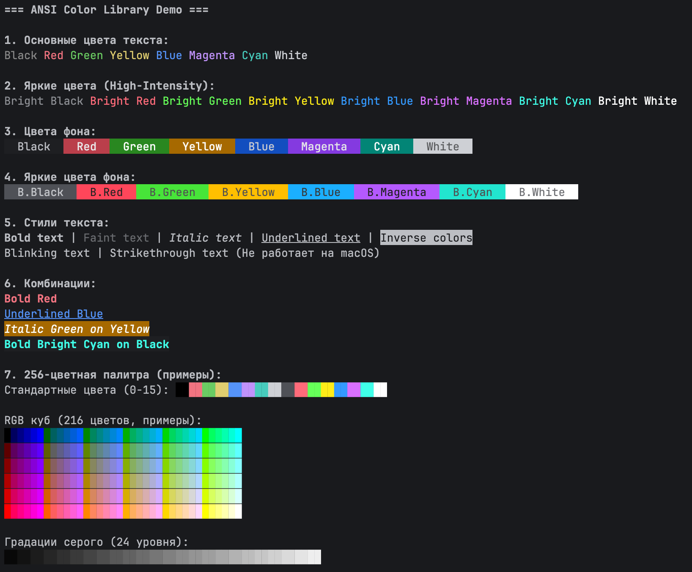

# ansi.h



### Поддерживаемые цвета и стили

**Стандартные цвета текста**
Оборачивайте строку в соответствующий макрос — цвет применится только к этой строке:
```c
printf(RED("Ошибка: ") GREEN("успешно загружено\n"));
```
Доступны: `BLACK`, `RED`, `GREEN`, `YELLOW`, `BLUE`, `MAGENTA`, `CYAN`, `WHITE`.

**Яркие (high-intensity) цвета**
Аналогично, но с более насыщенным оттенком:
```c
puts(BRIGHT_YELLOW("Внимание!") " — проверьте настройки.");
```
Доступны: `BRIGHT_BLACK` (серый), `BRIGHT_RED`, `BRIGHT_GREEN`, ..., `BRIGHT_WHITE`.

**Цвет фона**
Используйте префикс `ON_` для заливки фона:
```c
printf(ON_BLUE(WHITE(" Информация ")) "\n");
```
Поддерживаются как обычные (`ON_RED`, `ON_GREEN`, ...), так и яркие (`ON_BRIGHT_CYAN` и т.д.) фоны.

**256-цветная палитра**
Для точного подбора цвета используйте:
- **По номеру цвета (0–255):**
  ```c
  printf(FG256(202, "Оранжевый текст") BG256(23, " на тёмно-синем фоне\n"));
  ```
- **Через RGB-компоненты (0–5):**
  ```c
  printf(FG_CUBE(5, 3, 0, "Тёплый оранж")); // r=5, g=3, b=0
  ```
- **Оттенки серого (0–23):**
  ```c
  printf(FG_GRAY(8, "Средне-серый текст\n"));
  ```

**Стили текста**
Применяйте форматирование без цвета:
```c
printf(BOLD("Важно:") " прочтите инструкцию.\n");
printf(UNDERLINE("Ссылка") "\n");
```
Доступны: `BOLD`, `FAINT`, `UNDERLINE`, `ITALIC`, `BLINL`, `INVERSE`, `HIDDEN`, `STRIKETHROUGH`.

**Автоматический сброс**
Все макросы (`RED`, `ON_BLUE`, `BOLD` и др.) **автоматически сбрасывают** все атрибуты после переданной строки, поэтому последующий вывод остаётся незатронутым — не нужно вручную вставлять `ANSI_COLOR_RESET`.